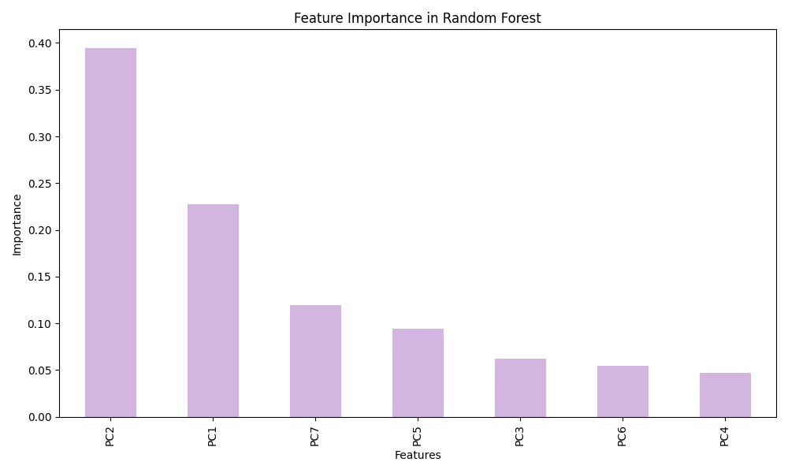
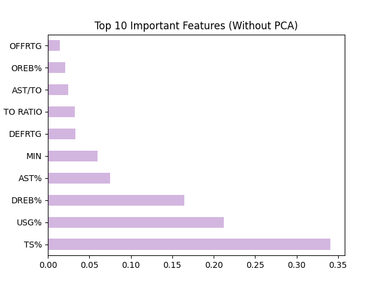
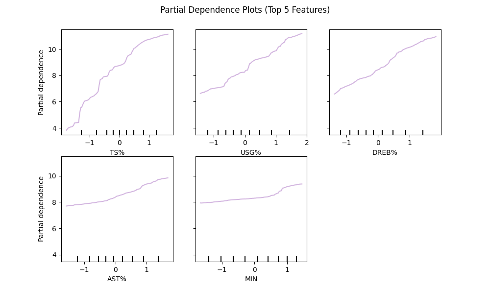
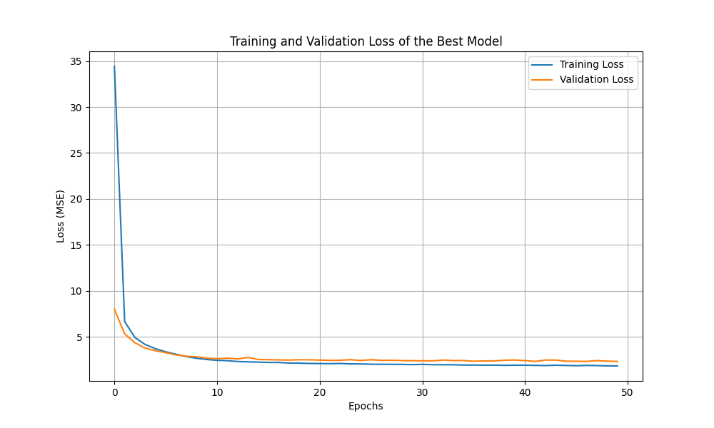

# Project-4
# NBA Player Performance Analysis and Prediction

This project analyzes NBA player performance metrics and applies various machine learning models to predict Player Impact Estimate (PIE) and group players based on performance patterns. The analysis is inspired by the movie *Moneyball* and aims to provide actionable insights into player performance, team strategy, and player development.

## Project Overview

In this project, the following techniques and models are used:

- **Data Preprocessing**: Handling missing values, outlier detection, feature scaling, and feature engineering (interaction terms, polynomial features, age binning).
- **Principal Component Analysis (PCA)**: Reducing the dimensionality of NBA player performance metrics.
- **K-Means Clustering**: Grouping similar players based on performance metrics.
- **Random Forest Regression**: Predicting Player Impact Estimate (PIE) using various performance metrics.
- **Neural Networks**: Further improving the predictive power for player performance.
- **Model Evaluation**: Cross-validation, feature importance analysis, and partial dependence plots for interpretability.

## Models Explored
### 1. **Optimized Linear Regression**
- **Technique**: Ordinary Least Squares (OLS) with optimization techniques.
- **Evaluation**: R² Score: 0.84
- **Strengths**: High interpretability.
- **Limitations**: Struggles with non-linearity and multicollinearity.
  
### 2. **Random Forest Regression with PCA**
- **Technique**: Random Forest after dimensionality reduction using PCA.
- **Evaluation**: R² Score: 0.80
- **Strengths**: Robust to multicollinearity, capable of capturing non-linear relationships.
- **Limitations**: Complexity and PCA may not fully capture feature interactions.

### 3. **Random Forest Regression without PCA**
- **Technique**: Random Forest on original features without dimensionality reduction.
- **Evaluation**: R² Score: 0.80
- **Strengths**: Flexibility, handles non-linear relationships, effective with large datasets.
- **Limitations**: More complex and computationally intensive.

### 4. **Neural Network Model with Adam Optimizer**
- **Technique**: A feedforward neural network was applied to the scaled dataset.
- **Evaluation**: R² Score: 0.86
- **Strengths**: Accurate, handles non-linear relationships, effective with large datasets.
- **Limitations**: Difficult to interpret, more complex and computationally intensive.

## Dataset

The dataset consists of NBA player playoff statistics from 2007 to 2024, with around 210 data points per year. The independent variables include:
- **Performance Metrics**: MIN (Minutes Played), OFFRTG (Offensive Rating), DEFRTG (Defensive Rating), TS% (True Shooting Percentage), USG% (Usage Percentage), AST% (Assist Percentage), etc.
- **Dependent Variable**: Player Impact Estimate (PIE).

## Project Files

- `NBA_Playoff_*.csv`: Raw NBA player playoff statistics for each year.
- `nba_analysis.ipynb`: Jupyter notebook containing all data analysis and machine learning code.
- `Project 4 Report.pdf`: Analysis report including Overview, Data Processing, Models Developed, Conclusions and Recommendations.
- `Project 4 Proposal.pdf`: Project proposal.
- - `Project 4 Presentation.pdf`: Project presentation.
- `README.md`: This README file.

## Usage

1. **Data Preprocessing**: The dataset is loaded, cleaned, and preprocessed for further analysis.
2. **Feature Engineering**: Interaction terms, polynomial features, and other feature engineering techniques are applied.
3. **PCA & K-Means Clustering**: Principal Component Analysis is performed to reduce dimensionality, followed by clustering to group similar players.
4. **Random Forest Regression**: The Random Forest model is trained and evaluated with and without PCA, followed by hyperparameter tuning.
5. **Neural Networks**: A neural network model is trained to predict PIE and is evaluated for model performance.

## Results

- **Feature Importance**: Key metrics like TS%, USG%, and DREB% were identified as the most important features in predicting PIE.
- **Model Performance**: Random Forest without PCA and Optimized Linear Regression showed strong performance with R² scores around 0.80.
- **Cluster Insights**: K-Means clustering helped identify different player profiles based on performance metrics.

## Key Visualizations

- **PCA Explained Variance**: Shows how much variance is captured by each principal component.
- **Feature Importance Plot**: Highlights the top contributing features for PIE prediction.
- **Partial Dependence Plots**: Illustrate the effect of individual features on predicted player performance.

## Future Work

- **Model Refinement**: Further tuning of neural networks and exploration of other models (e.g., XGBoost).
- **New Metrics**: Integrate advanced player tracking data or defensive metrics to improve prediction accuracy.
- **Expanded Timeframe**: Apply the model to more extensive regular-season datasets and compare performance trends.
- **Feature Engineering**: Include additional feature engineering in the model to explore interaction amongs independent variables and their impact on PIE.

## Real World Application
-  Teams can input a player's recent performance data (offensive and defensive ratings, shooting efficiency, usage rate, etc.) to estimate their future contributions. This helps scouts and teams prioritize certain players for trades, drafts, or signings
-  If the model suggests that players with higher TS% or USG% have better impact, coaches can design tailored training regimens to improve these specific skills for players with lower PIEs, accelerating their development.
-  Teams can adjust their strategy by favoring players with stronger performance metrics in key areas like rebounding (DREB%) or shooting efficiency (TS%) during critical games. The model allows real-time analysis of which lineups or player rotations will likely result in the best overall team performance.
  

## Terminology
- MIN (Minutes Played): The total number of minutes a player has spent on the court during the game or season.
- OFFRTG (Offensive Rating): The number of points a player generates per 100 possessions.
- DEFRTG (Defensive Rating): The number of points a player allows per 100 possessions.
- EFG% (Effective Field Goal Percentage): A shooting efficiency statistic that accounts for the fact that 3-point shots are worth more than 2-point shots.
- TS% (True Shooting Percentage): A measure of shooting efficiency that considers field goals, free throws, and 3-point shots.
- USG% (Usage Percentage): The percentage of team plays that a player was involved in while they were on the court, measured by shot attempts, free throw attempts, and turnovers.
- AST% (Assist Percentage): The percentage of teammate field goals a player assisted while on the floor.
- AST/TO (Assist to Turnover Ratio): The ratio of assists to turnovers a player records.
- OREB% (Offensive Rebounding Percentage): The percentage of available offensive rebounds a player grabs while on the floor.
- DREB% (Defensive Rebounding Percentage): The percentage of available defensive rebounds a player grabs while on the floor.
- REB% (Total Rebounding Percentage): The percentage of total available rebounds a player grabs (both offensive and defensive).
- TO RATIO (Turnover Ratio): The number of turnovers a player commits per 100 possessions.
- PACE (Pace): The number of turnovers a player commits per 100 possessions.
- AGE
- PIE (Player Impact Estimates): Player Impact Estimate (PIE) is an all-encompassing statistic that measures a player's overall statistical contribution in a game. PIE aims to calculate a player's impact on the game by considering all aspects of their performance, such as scoring, rebounding, assists, steals, blocks, and turnovers. It reflects the percentage of game events in which a player has a positive contribution. 

